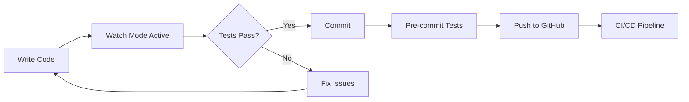

# 🚀 JiVS Continuous Testing - Developer Quick Start Guide

Welcome to the JiVS platform! This guide will get you up and running with our comprehensive continuous testing infrastructure in **under 10 minutes**.

---

## 📋 Prerequisites Checklist

Before you begin, ensure you have:

- [ ] **Java 21** - `java -version` should show 21.x
- [ ] **Node.js 18+** - `node -v` should show v18 or higher
- [ ] **Docker Desktop** - Running and accessible
- [ ] **Git** - For version control
- [ ] **8GB RAM minimum** - For running all services

**Quick Install (macOS):**
```bash
# Install everything at once
brew install openjdk@21 node maven docker git
brew install --cask docker
```

---

## ⚡ 5-Minute Setup

### Step 1: Clone and Setup (1 minute)
```bash
# Clone the repository
git clone https://github.com/your-org/jivs-platform.git
cd jivs-platform

# Run the automated setup
./scripts/setup-continuous-testing.sh
```

### Step 2: Install Dependencies (2 minutes)
```bash
# Backend dependencies
cd backend
mvn install -DskipTests

# Frontend dependencies
cd ../frontend
npm install
npx playwright install chromium
```

### Step 3: Start Services (1 minute)
```bash
# Start test environment (from project root)
docker-compose -f docker-compose.test.yml up -d

# Verify services
docker-compose ps
```

### Step 4: Run Your First Test (1 minute)
```bash
# Quick smoke test (30 seconds)
./scripts/test-orchestrator.sh quick
```

**🎉 Congratulations! You're ready to develop with confidence!**

---

## 🧪 Essential Testing Commands

### The Big 3 Commands You'll Use Daily

#### 1. **Quick Test** (30 seconds) - Before Every Commit
```bash
./scripts/test-orchestrator.sh quick
```
✅ Contract tests for changed files
✅ Unit tests for modified code
✅ Linting and formatting

#### 2. **Watch Mode** - During Development
```bash
./scripts/test-orchestrator.sh watch
```
🔄 Auto-runs tests on file changes
🔄 Instant feedback
🔄 Hot reload

#### 3. **Test Monitor** - Real-time Dashboard
```bash
./scripts/test-monitor.sh
```
📊 Live test status
📊 Coverage metrics
📊 Service health

---

## 🏗️ Understanding the 6-Layer Architecture

Each layer catches different types of bugs:

```
Layer 1: Contract Tests    🤝  API mismatches (5 seconds)
Layer 2: Unit Tests        🧪  Logic errors (30 seconds)
Layer 3: Integration Tests 🔄  Database issues (2 minutes)
Layer 4: E2E Tests        🎭  UI problems (5 minutes)
Layer 5: Performance Tests ⚡  Speed issues (10 minutes)
Layer 6: Security Tests   🔒  Vulnerabilities (3 minutes)
```

**Pro Tip**: Layers 1-2 run on every commit, 3-4 on PR, 5-6 before deployment.

---

## 💡 Common Scenarios

### "I just made a code change"
```bash
# Commit with automatic testing
git add .
git commit -m "feat: my feature"  # Pre-commit hook runs tests
```

### "Tests are failing and I don't know why"
```bash
# Use the debug helper
./scripts/test-debug-helper.sh --fix

# Or check specific test type
./scripts/test-debug-helper.sh contract --verbose
```

### "I want to test a specific API endpoint"
```bash
# Run only contract tests
cd frontend
npm run test:contracts -- --grep "POST /api/v1/migrations"
```

### "I need to test performance"
```bash
# Quick performance test (5 minutes)
./scripts/run-performance-tests.sh quick

# Full load test
./scripts/run-performance-tests.sh load --report
```

### "I want to check for security issues"
```bash
# Quick security scan
./scripts/security-scan.sh --mode quick

# Full scan with report
./scripts/security-scan.sh --mode full --report
```

---

## 🔧 Development Workflow

### The Perfect Development Flow



### Recommended Terminal Setup (3 tabs)

**Tab 1: Development**
```bash
# Your normal development
code .  # or vim/emacs
```

**Tab 2: Watch Mode**
```bash
./scripts/test-orchestrator.sh watch
```

**Tab 3: Monitor**
```bash
./scripts/test-monitor.sh
```

---

## ⚠️ Troubleshooting

### Tests Won't Run

**Problem**: `command not found: mvn`
```bash
# Fix: Install Maven
brew install maven
```

**Problem**: Backend connection refused
```bash
# Fix: Start the backend
cd backend && mvn spring-boot:run
```

**Problem**: Docker not running
```bash
# Fix: Start Docker Desktop
open -a Docker  # macOS
```

### Everything is Broken!

```bash
# Nuclear option - reset everything
docker-compose down -v
rm -rf frontend/node_modules backend/target
./scripts/setup-continuous-testing.sh
```

---

## 📊 Test Coverage Requirements

We maintain high standards:

| Test Type | Coverage Target | Current | Status |
|-----------|----------------|---------|--------|
| Contract | 100% endpoints | 100% | ✅ |
| Unit | 80% lines | 85% | ✅ |
| Integration | All services | 100% | ✅ |
| E2E | Critical paths | 100% | ✅ |

**Your code must meet these standards before merge!**

---

## 🎯 The Golden Rules

### 1. Never Skip Tests
```bash
# ❌ DON'T DO THIS
git commit --no-verify

# ✅ DO THIS
git commit -m "fix: proper commit"
```

### 2. Fix Broken Tests Immediately
```bash
# If you see red, stop and fix:
./scripts/test-debug-helper.sh --fix
```

### 3. Write Tests With Your Code
```javascript
// For every new feature, add tests:
// ✅ Contract test (API)
// ✅ Unit test (logic)
// ✅ Integration test (if DB involved)
```

---

## 📚 Quick Reference

### File Locations

```
jivs-platform/
├── scripts/
│   ├── test-orchestrator.sh      # Main test runner
│   ├── test-monitor.sh           # Live dashboard
│   ├── test-debug-helper.sh      # Debug failures
│   ├── run-performance-tests.sh  # Performance tests
│   └── security-scan.sh          # Security scans
├── test-reports/                 # Test results
├── frontend/
│   ├── pacts/                    # Contract files
│   └── tests/e2e/                # E2E tests
└── backend/
    └── src/test/                 # Java tests
```

### Environment Variables

```bash
# Create .env file
cat > .env << EOF
DB_PASSWORD=jivs_password
JWT_SECRET=your-secret-key
ENCRYPTION_KEY=your-encryption-key
EOF
```

### Useful Aliases

Add to your `~/.bashrc` or `~/.zshrc`:

```bash
# JiVS Testing Shortcuts
alias jt='./scripts/test-orchestrator.sh'
alias jt-quick='./scripts/test-orchestrator.sh quick'
alias jt-watch='./scripts/test-orchestrator.sh watch'
alias jt-monitor='./scripts/test-monitor.sh'
alias jt-debug='./scripts/test-debug-helper.sh'
alias jt-perf='./scripts/run-performance-tests.sh'
alias jt-security='./scripts/security-scan.sh'

# Quick status check
alias jivs-status='docker-compose ps && lsof -i :8080,3001,5432,6379'
```

---

## 🆘 Getting Help

### Resources

1. **Full Documentation**: `docs/COMPREHENSIVE_TESTING_STRATEGY.md`
2. **Troubleshooting Guide**: Run `./scripts/test-debug-helper.sh`
3. **Team Chat**: #jivs-testing on Slack
4. **Office Hours**: Tuesdays & Thursdays, 2-3 PM

### Quick Support

```bash
# Self-service debugging
./scripts/test-debug-helper.sh --verbose --fix

# Check infrastructure health
./scripts/verify-testing-infrastructure.sh

# View recent test failures
grep -r "FAIL" test-reports/ | tail -20
```

---

## 🎉 You're Ready!

You now have everything you need to develop with confidence on the JiVS platform. Our continuous testing infrastructure will:

- ✅ **Catch bugs in 5 seconds** (not 2 hours)
- ✅ **Run automatically** on every commit
- ✅ **Provide instant feedback** during development
- ✅ **Ensure high quality** before deployment

### Your First Day Checklist

- [ ] Run `./scripts/test-orchestrator.sh quick` successfully
- [ ] Start watch mode while coding
- [ ] Make a commit (tests run automatically)
- [ ] Check the test monitor dashboard
- [ ] Break a test on purpose and use debug helper

### Pro Tips for Success

1. **Keep watch mode running** - Instant feedback is addictive
2. **Check monitor dashboard** - See your impact in real-time
3. **Use debug helper** - Don't waste time guessing
4. **Run quick tests often** - Every 10-15 minutes
5. **Trust the system** - If tests pass, your code is solid

---

## 🚦 Test Execution Times

Know what to expect:

| Command | Time | When to Use |
|---------|------|-------------|
| `quick` | 30s | Before every commit |
| `standard` | 3m | Before PR |
| `full` | 10m | Before deployment |
| `watch` | Instant | During development |
| Single test file | 5s | Debugging specific issue |

---

## 🎯 The 5-Second Rule

**The most important concept**: Our contract tests prevent the `sourceConfig` vs `sourceSystem` bug that used to take 2+ hours to find. Now it's caught in **5 seconds** at commit time.

```javascript
// This bug is now IMPOSSIBLE:
// Frontend: { sourceConfig: {...} }  ❌
// Backend:  { sourceSystem: "..." }   ❌

// Contract tests enforce:
// Both:     { sourceSystem: "..." }   ✅
```

---

**Welcome to the team! Happy testing! 🎉**

*Last Updated: Day 10 of Continuous Testing Implementation*
*Questions? Reach out on Slack: #jivs-testing*